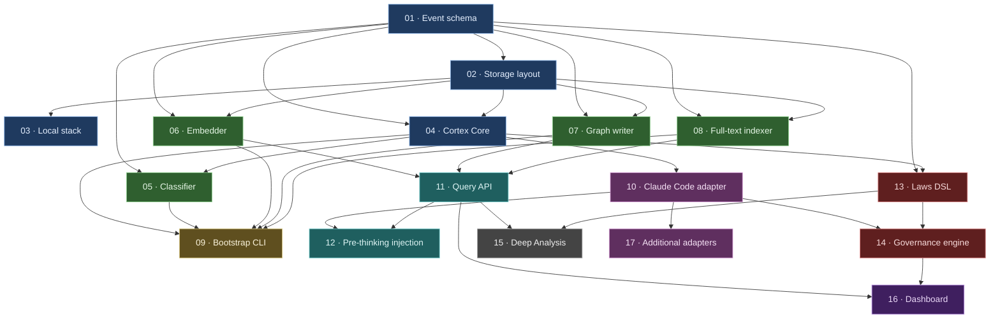

# Cortex — Dependency DAG

> **Version:** 0.1 · **Status:** Draft · **Last updated:** 2026-04-17
> **What it is:** the directed acyclic graph of the 17 specs in [`specs/`](specs/) — dependency order, critical path, and parallelizable tracks.

The DAG is derived from the `Depends on` column of [`specs/00-index.md`](specs/00-index.md). Any spec can be implemented as soon as every node it depends on is 🟢 *implemented*.

---

## 1. Dependency graph



**Color legend**

| Color (class) | Meaning                        | Specs         |
|---------------|--------------------------------|---------------|
| Foundation    | Substrate everyone builds on   | 01, 02, 03, 04|
| Processing    | Stateless workers              | 05, 06, 07, 08|
| Tooling       | One-shot / operator utilities  | 09            |
| Capture       | Adapter surface                 | 10, 17        |
| Retrieval     | Read path                      | 11, 12        |
| Governance    | Laws + enforcement             | 13, 14        |
| Analysis      | Deep Analysis workflow         | 15            |
| UI            | Dashboard                      | 16            |

## 2. Adjacency table (machine-readable)

| Spec | Depends on            | Unlocks                                  |
|-----:|-----------------------|------------------------------------------|
| 01   | —                     | 02, 04, 05, 06, 07, 08, 13               |
| 02   | 01                    | 03, 04, 06, 07, 08                       |
| 03   | 02                    | — (runtime prerequisite for all workers) |
| 04   | 01, 02                | 05, 09, 10, 13                           |
| 05   | 01, 04                | 09                                       |
| 06   | 01, 02                | 09, 11                                   |
| 07   | 01, 02                | 09, 11                                   |
| 08   | 01, 02                | 09, 11                                   |
| 09   | 04, 05, 06, 07, 08    | —                                        |
| 10   | 04                    | 12, 14, 17                               |
| 11   | 06, 07, 08            | 12, 15, 16                               |
| 12   | 10, 11                | —                                        |
| 13   | 01, 04                | 14, 15                                   |
| 14   | 13, 10                | 16                                       |
| 15   | 11, 13                | —                                        |
| 16   | 11, 14                | —                                        |
| 17   | 10                    | —                                        |

## 3. Topological build order

A valid total order (one of many) that respects every dependency:

```
01 → 02 → 03 → 04
     ├── 05 ─┐
     ├── 06 ─┼── 09
     ├── 07 ─┤       10 ─┬── 12
     ├── 08 ─┘           ├── 14 ─── 16
     └────────────── 11 ─┤
                          ├── 15
                          └── 17 ─ (via 10)
     13 ─┬── 14 (above)
         ├── 15 (above)
```

### Phase-aware ordering (matches [`roadmap.md`](roadmap.md))

- **Phase 0 — Foundations:** `01 → 02 → 03 → 04`
- **Phase 1 — Capture + retrieval:** `05, 06, 07, 08` (parallel) → `09` + `10` (parallel) → `11` → `12`
- **Phase 2 — Governance:** `13` → `14` → `16`
- **Phase 3 — Analysis + multi-adapter:** `15` + `17` (parallel)

## 4. Critical path

The longest chain — the wall-clock floor for shipping every capability — is:

```
01 → 02 → 04 → (06 | 07 | 08) → 11 → 12
                              ↓
                              14 → 16
```

Depth = **6 levels**. Any timeline slip here pushes the whole plan; anything off this chain can absorb delay without moving the launch date.

On the governance side:

```
01 → 04 → 13 → 14 → 16
```

…is length 5. `14` is on both critical paths and gates `16`.

## 5. Parallelizable tracks

Once a level is stable, spec groups can proceed in parallel without ordering:

| Track                    | Parallel set      | Gated by         |
|--------------------------|-------------------|------------------|
| Data workers             | 05, 06, 07, 08    | 04               |
| Adapter + bootstrap      | 09, 10            | 05+06+07+08      |
| Retrieval                | 11                | 06+07+08         |
| Pre-thinking + governance | 12, 14            | 10 + 11 / 10 + 13|
| Analysis + adapters       | 15, 17            | 11+13 / 10       |

## 6. Reverse dependencies ("blast radius")

If a spec needs revision after freeze, the set it invalidates (directly or transitively):

| Spec | Direct consumers                           | Transitive blast radius                                        |
|-----:|--------------------------------------------|----------------------------------------------------------------|
| 01   | 02, 04, 05, 06, 07, 08, 13                  | all 17                                                         |
| 02   | 03, 04, 06, 07, 08                          | 05, 09, 10, 11, 12, 13, 14, 15, 16, 17                         |
| 04   | 05, 09, 10, 13                              | 11, 12, 14, 15, 16, 17                                         |
| 10   | 12, 14, 17                                  | 16                                                             |
| 11   | 12, 15, 16                                  | —                                                              |
| 13   | 14, 15                                      | 16                                                             |

**Reading this:** a change to spec 01 invalidates everything. A change to spec 11 only touches 12/15/16. Plan schema work accordingly.

## 7. Node counts by layer

| Layer        | Specs | % of total |
|--------------|:----:|:----------:|
| Foundation   | 4    | 24%        |
| Processing   | 4    | 24%        |
| Tooling      | 1    | 6%         |
| Capture      | 2    | 12%        |
| Retrieval    | 2    | 12%        |
| Governance   | 2    | 12%        |
| Analysis     | 1    | 6%         |
| UI           | 1    | 6%         |

## 8. References

- [`specs/00-index.md`](specs/00-index.md) — canonical dependency source.
- [`architecture.md`](architecture.md) §11 — phased roadmap (narrative).
- [`roadmap.md`](roadmap.md) — phase-by-phase delivery plan derived from this DAG.
- [`prd.md`](prd.md) — what and why.
