# Cortex — Roadmap

> **Version:** 0.1 · **Status:** Draft · **Last updated:** 2026-04-17
> **Phased delivery plan** derived from [`prd.md`](prd.md) requirements and [`dag.md`](dag.md) dependencies.

This is an **intent**, not a contract. Week counts are budgets — slips come out of the buffer between phases, not out of scope. Each phase closes only when its exit criteria are met.

---

## Timeline overview

```mermaid
gantt
    title Cortex delivery (weeks from Phase-0 start)
    dateFormat  X
    axisFormat  W%w
    section Phase 0 · Foundations
    Event schema & storage lock           :p0a, 0, 1w
    Local stack + cortex-core skeleton    :p0b, after p0a, 1w
    section Phase 1 · Capture + retrieval
    Workers (05/06/07/08)                 :p1a, 2, 2w
    Bootstrap CLI (09)                    :p1b, after p1a, 1w
    Claude Code adapter (10)              :p1c, after p1a, 1w
    Query API (11) + pre-thinking (12)    :p1d, after p1b, 1w
    section Phase 2 · Governance
    Laws DSL (13)                         :p2a, 6, 1w
    Governance engine (14)                :p2b, after p2a, 1w
    Dashboard v1 (16)                      :p2c, after p2b, 2w
    section Phase 3 · Analysis + adapters
    Deep Analysis (15)                    :p3a, 10, 2w
    Cursor/Codex/Gemini adapters (17)     :p3b, 10, 2w
    section Phase 4 · Hardening
    Retrieval-quality pass + a11y polish  :p4, 12, 2w
    section Phase 5 · HivehubCloud (open)
    Multi-tenant + trust feed             :p5, 14, 4w
```

**Totals:** Phases 0–3 target **12 weeks**; Phase 4 adds 2 (hardening); Phase 5 opens a separate track.

---

## Phase 0 — Foundations (weeks 0–1)

**Goal:** lock the wire format, stand up the data stack, and prove one event end-to-end.

### Scope

- Freeze [spec 01 — Event schema](specs/01-event-schema.md).
- Finalize [spec 02 — Storage layout](specs/02-storage-layout.md).
- Bring up [spec 03 — Local stack (docker-compose)](specs/03-local-stack.md): Vectorizer, Nexus, Synap, Meilisearch.
- Implement [spec 04 — Cortex Core](specs/04-cortex-core.md) skeleton: typed events, redactor, ingestion router.

### Deliverables

- Runnable `docker-compose up` with all four backends healthy.
- `cortex-core` HTTP endpoint accepting one hand-crafted event and writing to the Parquet archive + Synap.
- Event schema JSON Schemas published under `cortex-core/schemas/`.

### Exit criteria

- [ ] Specs 01, 02, 03, 04 flipped to 🟢.
- [ ] Smoke test: `curl` a synthetic event → visible in Parquet + Synap within 1 s.
- [ ] Open questions in [`architecture.md` §12](architecture.md) resolved (classifier migration trigger, event-bus durability, adapter granularity, law UX, cross-repo identity, user-vs-model punishment, schema evolution).

### Risks / mitigations

- **Data-services readiness.** Hive services occasionally drift. Mitigation: pin versions in `docker-compose.yml`; test against those.
- **Schema over-scope.** Temptation to "get it right first time" freezes progress. Mitigation: version the schema; accept a v2 later.

---

## Phase 1 — Bootstrap + Claude Code adapter + basic retrieval (weeks 2–5)

**Goal:** day-1-useful retrieval, backed by the 17-repo corpus, via Claude Code hooks.

### Scope

- Parallel workers: [05 classifier](specs/05-classifier.md), [06 embedder](specs/06-embedder.md), [07 graph writer](specs/07-graph-writer.md), [08 full-text indexer](specs/08-fulltext-indexer.md).
- [09 bootstrap CLI](specs/09-bootstrap-cli.md) over all 17 repos.
- [10 Claude Code adapter](specs/10-claude-code-adapter.md) in capture-only mode (no blocking laws yet).
- [11 query API](specs/11-query-api.md) (vector + keyword + graph + RRF).
- [12 pre-thinking injection](specs/12-pre-thinking-injection.md) wired into the adapter.

### Parallel tracks (DAG-informed)

| Track                        | Weeks | Specs          |
|------------------------------|-------|----------------|
| Processing workers           | 2–3   | 05, 06, 07, 08 |
| Bootstrap CLI                | 3–4   | 09             |
| Claude Code adapter          | 3–4   | 10             |
| Query API + pre-thinking     | 4–5   | 11, 12         |

### Deliverables

- Bootstrap ingests all 17 repos end-to-end within the 4–8 h envelope.
- A real Claude Code session emits envelope-compliant events.
- `POST /v1/query intent=pre_change_context` returns a non-empty bundle in the Vectorizer repo.
- `additionalContext` visible in the Claude Code session after a `/v1/query` round-trip.

### Exit criteria

- [ ] Specs 05–12 flipped to 🟢.
- [ ] Pre-thinking consultation rate ≥ 95% in a hand-picked repo (Vectorizer).
- [ ] Hot-path P95 < 150 ms (cached), cold < 500 ms.
- [ ] Bootstrap completes ≤ 8 h on a dev machine.

### Risks / mitigations

- **Classifier cost overshoot during bootstrap.** Mitigation: cap via `--budget-usd`; static fallback for low-priority events (spec 05).
- **Retrieval quality disappoints.** Mitigation: golden-set eval on 50 hand-labeled queries at end-of-phase; target top-5 precision ≥ 0.7 as a floor.
- **Adapter hook-budget overruns.** Mitigation: fail-open everywhere (spec 10 Decision 4).

---

## Phase 2 — Governance (weeks 6–9)

**Goal:** enforce critical laws at the edge; surface everything visually; publish trust scores.

### Scope

- [13 laws DSL + detector sandbox](specs/13-laws-dsl.md).
- [14 governance engine](specs/14-governance-engine.md): enforcement ladder, reminders, trust score.
- [16 dashboard v1](specs/16-dashboard.md): timeline, memory, decisions, laws, tool analytics, graph. (Analysis library ships in Phase 3.)

### Deliverables

- Law authoring flow in the dashboard: draft → lint → publish.
- `PreToolUse` in Claude Code adapter blocks a synthetic LAW-007 (`--no-verify`).
- Nightly trust-score recompute + `/v1/governance/trust` endpoint.
- Dashboard live timeline over SSE with filters.

### Exit criteria

- [ ] Specs 13, 14, 16 (sans Analysis library) flipped to 🟢.
- [ ] Blocking-law false-block rate < 1% on the validation law set.
- [ ] Trust score visible per `(model, repo)` in the dashboard.
- [ ] Lighthouse a11y ≥ 90 on Timeline + Decisions views.

### Risks / mitigations

- **Detector sandbox escapes.** Mitigation: default-deny Deno permissions; CPU/memory caps (spec 13 Decision 1).
- **Reminder spam.** Mitigation: per-session cap (10) + per-(session, law) dedup (spec 14).
- **Dashboard scaffold drift from Vectorizer.** Mitigation: import as a forked-but-tracked scaffold; schedule a quarterly sync.

---

## Phase 3 — Deep Analysis + multi-adapter (weeks 10–11)

**Goal:** structured debate → auditable Decisions; capture parity across Cursor, Codex, Gemini.

### Scope

- [15 Deep Analysis](specs/15-deep-analysis.md): CLI + HTTP + SSE.
- Dashboard Analysis library (picks up from Phase 2).
- [17 additional adapters](specs/17-additional-adapters.md): Cursor (observational), Codex (full parity), Gemini (observational).

### Parallel tracks

| Track                   | Weeks  | Specs |
|-------------------------|--------|-------|
| Deep Analysis           | 10–11  | 15    |
| Cursor/Codex/Gemini      | 10–11  | 17    |

### Deliverables

- Running a `cortex analysis start` with a 3-panelist, 3-round debate produces one `Decision` node indexed for `similar_problems` queries within 30 s.
- `cortex-adapters install all` installs all four adapters idempotently; `status` reflects per-tool health.
- Shared `cortex-adapters/common/` crate in use by all adapters.

### Exit criteria

- [ ] Specs 15, 17 flipped to 🟢.
- [ ] Deep Analysis auto-judge top-5 precision ≥ 0.7 on the golden set of 20 transcripts.
- [ ] Three-adapter concurrent session produces three distinct `Session` nodes; graph traversal surfaces all three on a shared Artifact.

### Risks / mitigations

- **Cursor hooks too narrow.** Mitigation: file-watcher path + `_cortex_context.md` workspace write (spec 17 §Cursor).
- **Gemini SDK churn.** Mitigation: degrade gracefully to prompt-only capture; metric alert on `tool_observation_unavailable`.

---

## Phase 4 — Hardening + retrieval-quality pass (weeks 12–13)

**Goal:** turn a working product into a reliable one.

### Scope

- Retrieval-quality evaluation framework (golden sets, per-intent RRF weighting).
- Per-collection embedder model overrides (spec 06 OQ 1).
- Language-aware tokenization experiments for Meilisearch (spec 08 OQ 2).
- Dashboard a11y polish; keyboard-only navigation verification.
- Schema-drift migration tooling (spec 06 Decision 5; spec 14 trust recompute resilience).
- Alerting integration (Prometheus → on-call channel).

### Exit criteria

- [ ] Top-5 precision on the golden set ≥ 0.8 (up from the 0.7 Phase-1 floor).
- [ ] SLOs published for hot-path latency + capture success + classifier cost; alerts wired.
- [ ] Documented migration runbook for event-schema v1 → v2.

### Risks / mitigations

- **"Hardening" becomes a never-ending sink.** Mitigation: explicit 2-week box; anything that slips rolls into Phase 5 or a dedicated follow-up.

---

## Phase 5 — HivehubCloud integration (open; starts week 14)

**Goal:** make Cortex multi-tenant and wire its trust signals into cloud routing.

### Scope

- Per-tenant workspace isolation across all data backends.
- Distributed deployment guide (Vectorizer / Nexus HA via Raft).
- Trust-score publication endpoint consumed by HivehubCloud router (via Rulebook).
- OIDC authentication (replace v1 single-key auth).
- Operator API key management + audit.

### Exit criteria

- [ ] Two tenants running on one deployment with strict data isolation, verified by a red-team exercise.
- [ ] HivehubCloud routes requests using live trust deltas.

### Notes

- Phase 5 scope may split into multiple Rulebook tasks once priorities are clearer. No hard date; it opens after Phase 4 closes.

---

## Milestones summary

| Milestone                                    | Phase | Week | Gates on                                         |
|----------------------------------------------|------:|-----:|--------------------------------------------------|
| M0 — Foundations complete                    |   0   |  2   | Specs 01–04 🟢                                    |
| M1 — 17-repo corpus retrievable               |   1   |  5   | Specs 05–09 🟢 + first successful bootstrap       |
| M2 — Claude Code pre-thinking live           |   1   |  5   | Specs 10–12 🟢                                    |
| M3 — Blocking governance live                |   2   |  7   | Specs 13, 14 🟢                                   |
| M4 — Dashboard v1                            |   2   |  9   | Spec 16 🟢 (sans Analysis view)                   |
| M5 — Deep Analysis + multi-adapter parity    |   3   | 11   | Specs 15, 17 🟢                                   |
| M6 — Retrieval-quality floor met             |   4   | 13   | Top-5 precision ≥ 0.8                              |
| M7 — HivehubCloud integration v1             |   5   | open | Specs 02/14/… revisions; tenant isolation gate    |

---

## Working rules (apply to every phase)

These are stated once here to avoid repetition across phase sections; they come from [`AGENTS.md`](../AGENTS.md).

- **Diagnostic-first.** Run `tsc --noEmit` / `cargo check` before tests, every iteration.
- **Sequential editing.** One file at a time; decompose 3+ file tasks.
- **Fail-twice → escalate.** Never a third repeat of a failed approach without new evidence.
- **Knowledge capture.** End of each task: `rulebook_knowledge_add` + `rulebook_learn_capture` for anything non-obvious.
- **Task workflow.** Pick the first unchecked item from the lowest-numbered phase; use Rulebook MCP tools (`rulebook_task_create`, `rulebook_task_update`, `rulebook_task_archive`).
- **Quality gates.** Type-check + lint (0 warnings) + tests (100%) + coverage (≥95%) + `npm audit` before commit.

---

## Change history

| Date       | Change                                                                 |
|------------|------------------------------------------------------------------------|
| 2026-04-17 | Initial roadmap drafted in parallel with PRD and DAG; Phases 0–5 set.   |

## References

- [`prd.md`](prd.md) — product requirements.
- [`dag.md`](dag.md) — spec dependency graph.
- [`architecture.md`](architecture.md) — the big picture.
- [`specs/00-index.md`](specs/00-index.md) — specs with their status flags.
- [`AGENTS.md`](../AGENTS.md) — working rules.
